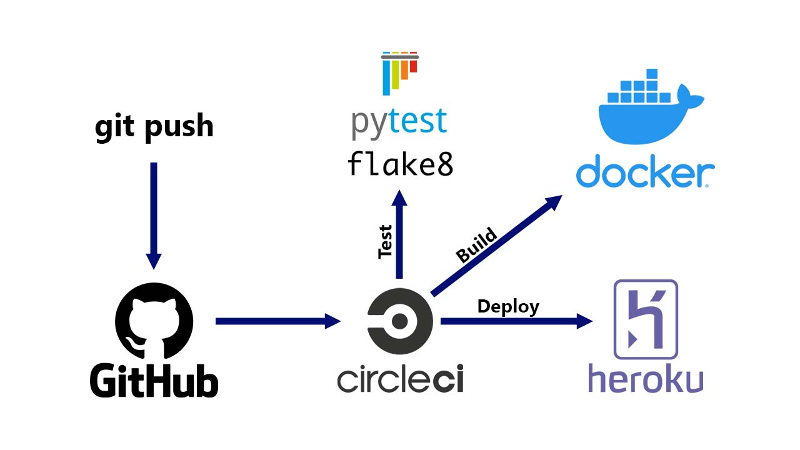
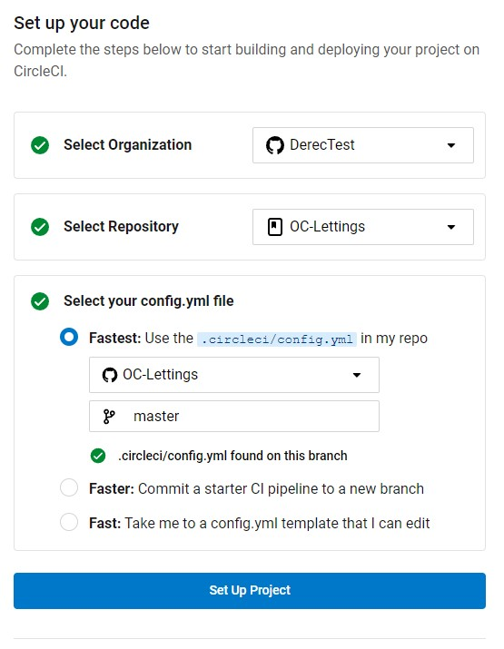
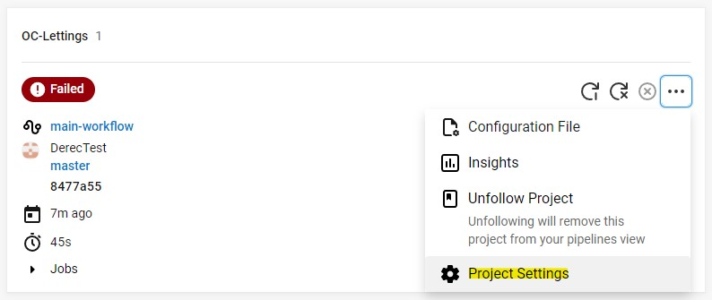
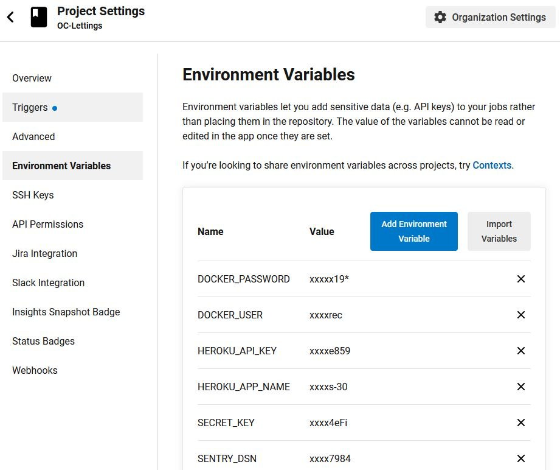

<div id="top"></div>


<!-- PROJECT LOGO -->
<br/>
<div align="center">
  <a href="https://github.com/KDerec/OC-Lettings/blob/master/images/logo.png">
    
  </a>

<h3 align="center">Scale a Django application with CircleCI, Docker, Heroku and Sentry</h3>
  <p align="center">
  </a>
    <a href="https://app.circleci.com/pipelines/github/KDerec">
    
  </a>
  </p>
  <p align="center">
    This student project is the #10 of my training.<br>You can follow the previous one <a href="https://github.com/KDerec/CRM_epic_events">here</a>.
  </p>
  </p>
</div>


<!-- TABLE OF CONTENTS -->
<details>
    <summary>Table of Contents</summary>
    <ol>
        <li><a href="#about-the-project">About The Project</a></li>
        <li><a href="#built-with">Built With</a></li>
        <li><a href="#getting-started">Getting Started</a>
            <ul>
                <li><a href="#local-development">Local development</a></li>
                <ul>
                    <li><a href="#l-prerequisites">Prerequisites</a></li>
                    <li><a href="#installation">Installation</a></li>
                    <li><a href="#usage">Usage</a></li>
                    <ul>
                        <li><a href="#linting">Linting</a></li>
                        <li><a href="#unit-tests">Unit tests</a></li>
                        <li><a href="#database">Database</a></li>
                        <li><a href="#administration-panel">Administration panel</a></li>
                    </ul>
                </ul>
                <li><a href="#Deployment">Deployment</a></li>
                <ul>
                    <li><a href="#how-its-works-">How it's works ?</a></li>
                    <li><a href="#d-prerequisites">Prerequisites</a></li>
                    <li><a href="#deploy-from-zero-and-yourself-repository">Deploy from zero and yourself repository</a></li>
                </ul>
            </ul>
        </li>
        <li><a href="#license">License</a></li>
        <li><a href="#contact">Contact</a></li>
    </ol>
</details>


<!-- ABOUT THE PROJECT -->
## About The Project
### 🌱 Developped skills
* Apply a modular architecture in a Python application
* Manage code production using the **CI/CD** methodology with **CircleCI**
* Refactor an application to reduce technical debt
* **Deploy** an application using **Heroku**
* Implement a code control system using **Sentry**

### 📖 Scenario
I’m a junior developer at **Orange County Lettings**, a startup in the real estate rental industry and the company has decided to take action to **improve them site** and **its deployment**.  

For that, Dominique, my technical director, asked me :  
“Here are the areas of the site and deployment that we would like you to improve or add:  
1. Reduction of various **technical liabilities** on the project
2. Redesign of the **modular architecture**
3. Added a **CI/CD pipeline using CircleCI** and Heroku
4. Application **monitoring** and **error tracking** via Sentry.

### 🚧 🚀 Project goal & deliverable
Briefly show the site running on localhost, and explain the problems encountered when setting up the **local development** environment.  
After presenting the link to the [**Heroku deployment deliverable**](https://oc-lettings-30.herokuapp.com/), delete the Heroku application, create a new one, and redeploy the site by running the [**CI/CD pipeline in CircleCI**](https://app.circleci.com/pipelines/github/KDerec/OC-Lettings).  
Once the CI/CD pipeline is complete, resubmit the site via the link to the new Heroku deployment.  
Run the Docker command that pulls the [**image from Docker Hub**](https://hub.docker.com/repository/docker/kderec/oc-lettings) and manages the site locally.  

<p align="right">(<a href="#top">back to top</a>)</p>


### Built With
* [Python 3.9.6](https://www.python.org/)
* [Django 3.0](https://www.djangoproject.com/)
* [SQLite3](https://www.sqlite.org/index.html)
* [CircleCI 2.1](https://circleci.com/)
* [Docker](https://www.docker.com/)
* [Heroku 7.53](https://www.heroku.com/)

<p align="right">(<a href="#top">back to top</a>)</p>


<!-- GETTING STARTED -->
## Getting Started

There are two sections, one to get a local copy and another to deploy the application on a Heroku server.

## Local development

To get a local copy up and running follow these simple example steps.

### L-Prerequisites

* [GitHub](https://github.com/) account with read access to this repository
* [Git CLI](https://git-scm.com/downloads)
* [SQLite3 CLI](https://www.sqlite.org/index.html)
* [Python](https://www.python.org/) interpreter, version 3.6 or higher

In the rest of the local development documentation, it is assumed that the `python` command in your shell OS runs the above Python interpreter (unless a virtual environment is enabled).

<p align="right">(<a href="#top">back to top</a>)</p>


### Installation
1. Clone the project in desired directory ;
   ```sh
   git clone https://github.com/KDerec/OC-Lettings.git
   ```
3. Change directory to project folder ;
   ```sh
   cd path/to/OC-Lettings
   ```
4. Create a virtual environnement *(More detail to [Creating a virtual environment](https://packaging.python.org/en/latest/guides/installing-using-pip-and-virtual-environments/#creating-a-virtual-environment))* ;
    * For Windows :
      ```sh
      python -m venv venv
      ```
    * For macOS / Linux :
      ```sh
      python3 -m venv venv
      ```
5. Activate the virtual environment ;
    * For Windows :
      ```sh
      .\venv\Scripts\activate
      ```
    * For macOS / Linux :
      ```sh
      source venv/bin/activate
      ```
6. Install package of requirements.txt ;
   ```sh
   pip install -r requirements.txt
   ```
7. Create a `.env` file in the root project directory with a SECRET_KEY for Django, for example :
   ```sh
   # in .env
   SECRET_KEY = "Yf7S^Z}FShCCm+ZdSb51vA)rr<4eFi"
   ```
8. Run the server ;
   ```sh
   python manage.py runserver
   ```
9. Now the application is accessible in your browser at http://localhost:8000 🎉.

<p align="right">(<a href="#top">back to top</a>)</p>


### Usage
#### Linting
*Adapt the virtual environment activation to your system.*
```sh
cd path/to/OC-Lettings
source venv/bin/activate
flake8
```
#### Unit tests
*Adapt the virtual environment activation to your system.*
```sh
cd path/to/OC-Lettings
source venv/bin/activate
pytest
```
#### Database
* Open sqlite3 command-line program ([doc here](https://www.sqlite.org/cli.html)) in your `path/to/OC-Lettings` ;
* Connect to the database `.open oc-lettings-site.sqlite3` ;
* Display the tables in the database `.tables` ;
* Display the columns in the profiles table, `pragma table_info(profiles_profile);`
* Run a query on the profiles table, `select user_id, favorite_city from profiles_profile where favorite_city like 'B%';`
* `.quit` to exit.

#### Administration panel
* Go to `http://localhost:8000/admin` ;
* Log in with user `admin`, password `Abc1234!`.

<p align="right">(<a href="#top">back to top</a>)</p>


## Deployment

The application is deployed on **Heroku** using **CircleCi** pipeline and **Docker** container.  

### How it's works ?
When a developer executes a `git push` command to the `master` branch of the project, it's run a pipeline on **CircleCi** and this pipeline run a set of processess consisting of **building** and **testing** stage before **deployment**.  

If testing *(pytest + flake8)* and building *(docker image)* are successful, docker image is **pushed** to [DockerHub](https://hub.docker.com/repository/docker/kderec/oc-lettings) and deploy to [Heroku](https://oc-lettings-30.herokuapp.com/).

The details of the **pipeline configuration** are available in the [config.yml](https://github.com/KDerec/OC-Lettings/blob/master/.circleci/config.yml) file of the .circleci folder and the the **instructions to build docker images** are in [Dockerfile](https://github.com/KDerec/OC-Lettings/blob/master/Dockerfile).

<a href="https://github.com/KDerec/OC-Lettings/blob/master/images/illustration.jpg">
  
</a>

#### Condition
Only modification to `master` branch execute the push of the Docker image to DockerHub and the Heroku deployment.  
Changes to other branches will only trigger testing and linting.

<p align="right">(<a href="#top">back to top</a>)</p>


### D-Prerequisites

* [GitHub](https://github.com/) account with read access to this repository
* [DockerHub](https://hub.docker.com/) Account
* Accept to login to [CircleCI](https://circleci.com/) with your GitHub account
* [Heroku](https://www.heroku.com/) Account
* [Heroku CLI](https://devcenter.heroku.com/articles/heroku-cli) installed

<p align="right">(<a href="#top">back to top</a>)</p>


### Deploy from zero and yourself repository
1. Fork this [repo](https://github.com/KDerec/OC-Lettings) (How to fork a repo ? [Very clear answer](https://docs.github.com/fr/get-started/quickstart/fork-a-repo)) ;
2. Follow the [installation guide](#installation) to setup the project ;
3. Logged with your Docker account to hub.docker.com, create a [new **public** repository](https://hub.docker.com/repository/create) with `oc-lettings` name (**it's important**); 
4. Connected to **Heroku dashboard**, [create a new app](https://dashboard.heroku.com/new-app) ;
5. Open a new terminal, enter the command below and follow the instruction to login ([more detail about Heroku CLI authentification](https://devcenter.heroku.com/articles/authentication)):
   ```sh
   heroku login
   ```
6. Retrieve your **API token** by entering the command below and keep this token (for example : `c4cd94da15ea0544802c2cfd5ec4ead324327430`):
   ```sh
   heroku auth:token
   ```
7. Login to **CircleCI** with your **GitHub** account ;
8. Set up your project by selecting your `OC-Lettings` repository and the `config.yml` file from `master` branch ;  
  <a href="https://github.com/KDerec/OC-Lettings/blob/master/images/set_up_project_circleci.jpg"></a>
1. You will see your project and it's status will be `Failed`, but it's **normal**, because we haven't configured the project yet ;  
2. To do that, go to `Project Settings` ;  
  <a href="https://github.com/KDerec/OC-Lettings/blob/master/images/project_setting_circleci.jpg"></a>
1.  Add environment variables below ;  

  | Name            | Value                                                               |
  |-----------------|---------------------------------------------------------------------|
  | DOCKER_PASSWORD | Your docker password account                                        |
  | DOCKER_USER     | Your docker username account                                        |
  | HEROKU_API_KEY  | The token you generated before with the `heroku auth:token` command |
  | HEROKU_APP_NAME | The name of the app you created in Heroku                           |

  <a href="https://github.com/KDerec/OC-Lettings/blob/master/images/env_var_circleci.jpg"></a>  
12. Go back to the [pipelines of the project](https://app.circleci.com/pipelines), rerun the workflow and wait until `Success` ;  
13. Go to heroku dashboard, open your app and congratulation, it's **deploy** ! 🎉

<p align="right">(<a href="#top">back to top</a>)</p>


<!-- LICENSE -->
## License
Distributed under the MIT License. See `LICENSE` for more information.

<p align="right">(<a href="#top">back to top</a>)</p>


<!-- CONTACT -->
## Contact
Kévin Dérécusson 👇🏻  
Email : kevin.derecusson@outlook.fr  
LinkedIn : https://www.linkedin.com/in/kevin-derecusson/  

<p align="right">(<a href="#top">back to top</a>)</p>


<i>This student project is the 10# of my training.<br>You can follow the previous one <a href="https://github.com/KDerec/CRM_epic_events">here</a>.</i>
